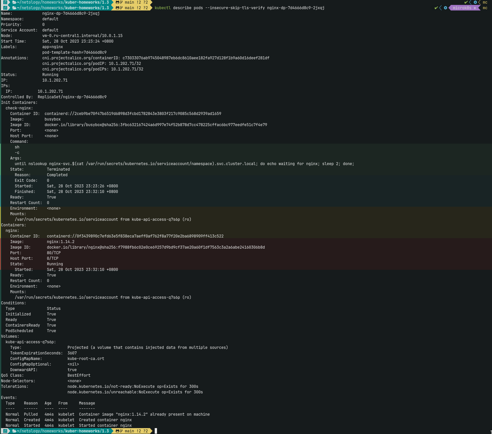

# Домашнее задание к занятию «Запуск приложений в K8S»

### Цель задания

В тестовой среде для работы с Kubernetes, установленной в предыдущем ДЗ, необходимо развернуть Deployment с приложением, состоящим из нескольких контейнеров, и масштабировать его.

------

### Чеклист готовности к домашнему заданию

1. Установленное k8s-решение (например, MicroK8S).
2. Установленный локальный kubectl.
3. Редактор YAML-файлов с подключённым git-репозиторием.

> Развернул MicroK8S на ВМ в Яндекc.Облако с помощью ansible: [install_microk8s.yml](../1.1/playbook/install_microk8s.yml)
------

### Инструменты и дополнительные материалы, которые пригодятся для выполнения задания

1. [Описание](https://kubernetes.io/docs/concepts/workloads/controllers/deployment/) Deployment и примеры манифестов.
2. [Описание](https://kubernetes.io/docs/concepts/workloads/pods/init-containers/) Init-контейнеров.
3. [Описание](https://github.com/wbitt/Network-MultiTool) Multitool.

------

### Задание 1. Создать Deployment и обеспечить доступ к репликам приложения из другого Pod

1. Создать Deployment приложения, состоящего из двух контейнеров — nginx и multitool. Решить возникшую ошибку.
   * Создал [Deployment](./src/deploy_app.yaml) 
     
2. После запуска увеличить количество реплик работающего приложения до 2.
3. Продемонстрировать количество подов до и после масштабирования.
   
4. Создать Service, который обеспечит доступ до реплик приложений из п.1.
   * Создал [Service](./src/service_app.yaml)
     
5. Создать отдельный Pod с приложением multitool и убедиться с помощью `curl`, что из пода есть доступ до приложений из п.1.
   

------

### Задание 2. Создать Deployment и обеспечить старт основного контейнера при выполнении условий

1. Создать Deployment приложения nginx и обеспечить старт контейнера только после того, как будет запущен сервис этого приложения.
   * Создал [Deployment](./src/nginx.yaml)
2. Убедиться, что nginx не стартует. В качестве Init-контейнера взять busybox.
   
3. Создать и запустить Service. Убедиться, что Init запустился.
   * Создал [Service](./src/nginx_svc.yaml)  
4. Продемонстрировать состояние пода до и после запуска сервиса.
   * до
     
   * после
      

------

