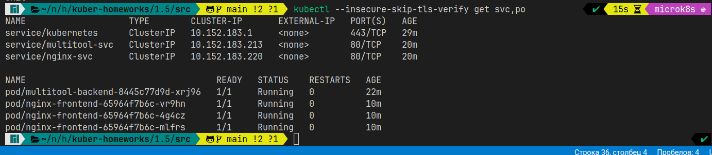
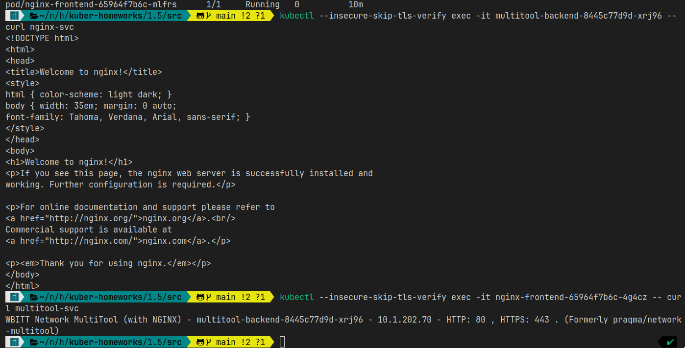
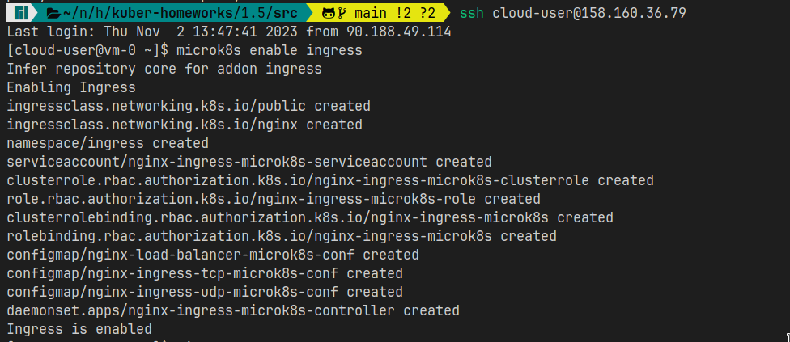
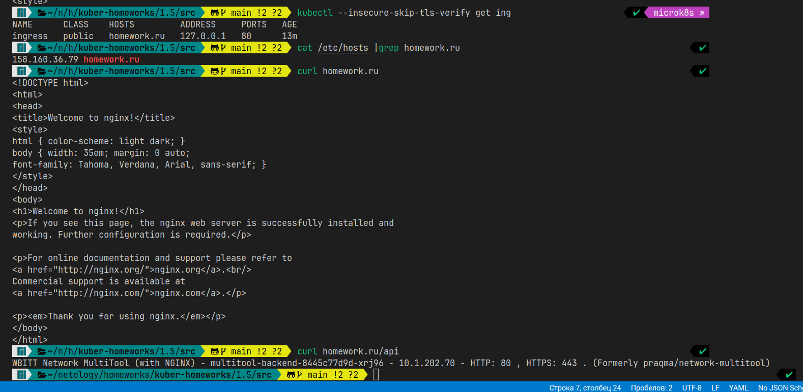

# Домашнее задание к занятию «Сетевое взаимодействие в K8S. Часть 2»

### Цель задания

В тестовой среде Kubernetes необходимо обеспечить доступ к двум приложениям снаружи кластера по разным путям.

------

### Чеклист готовности к домашнему заданию

1. Установленное k8s-решение (например, MicroK8S).
2. Установленный локальный kubectl.
3. Редактор YAML-файлов с подключённым Git-репозиторием.

> Развернул MicroK8S на ВМ в Яндекc.Облако с помощью ansible: [install_microk8s.yml](../1.1/playbook/install_microk8s.yml)
------

### Инструменты и дополнительные материалы, которые пригодятся для выполнения задания

1. [Инструкция](https://microk8s.io/docs/getting-started) по установке MicroK8S.
2. [Описание](https://kubernetes.io/docs/concepts/services-networking/service/) Service.
3. [Описание](https://kubernetes.io/docs/concepts/services-networking/ingress/) Ingress.
4. [Описание](https://github.com/wbitt/Network-MultiTool) Multitool.

------

### Задание 1. Создать Deployment приложений backend и frontend

1. Создать Deployment приложения _frontend_ из образа nginx с количеством реплик 3 шт.
   * Создал [Deployment](./src/nginx-frontend.yaml)
2. Создать Deployment приложения _backend_ из образа multitool.
   * Создал [Deployment](./src/multitool-backend.yaml)
3. Добавить Service, которые обеспечат доступ к обоим приложениям внутри кластера.
   * Добавил Service для [_frontend_](./src/nginx_svc.yaml) и [_backend_](./src/multitool_svc.yaml)
4. Продемонстрировать, что приложения видят друг друга с помощью Service.
   
   

------

### Задание 2. Создать Ingress и обеспечить доступ к приложениям снаружи кластера

1. Включить Ingress-controller в MicroK8S.
   
2. Создать Ingress, обеспечивающий доступ снаружи по IP-адресу кластера MicroK8S так, чтобы при запросе только по адресу открывался _frontend_ а при добавлении /api - _backend_.
   * Создал [Ingress](./src/ingress.yaml)
3. Продемонстрировать доступ с помощью браузера или `curl` с локального компьютера.
   
