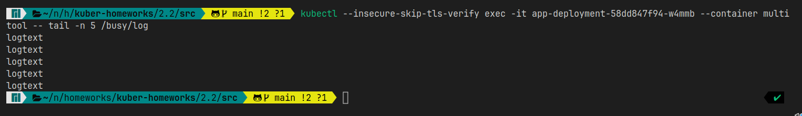

# Домашнее задание к занятию «Хранение в K8s. Часть 2»

### Цель задания

В тестовой среде Kubernetes нужно создать PV и продемострировать запись и хранение файлов.

* Развернул MicroK8S на ВМ в Яндекc.Облако с помощью ansible: [install_microk8s.yml](../1.1/playbook/install_microk8s.yml)
-------

### Дополнительные материалы для выполнения задания

1. [Инструкция по установке NFS в MicroK8S](https://microk8s.io/docs/nfs). 
2. [Описание Persistent Volumes](https://kubernetes.io/docs/concepts/storage/persistent-volumes/). 
3. [Описание динамического провижининга](https://kubernetes.io/docs/concepts/storage/dynamic-provisioning/). 
4. [Описание Multitool](https://github.com/wbitt/Network-MultiTool).

------

### Задание 1

**Что нужно сделать**

Создать Deployment приложения, использующего локальный PV, созданный вручную.

1. Создать Deployment приложения, состоящего из контейнеров busybox и multitool.
   * Создал [Deployment](./src/deployment_app.yaml)
2. Создать PV и PVC для подключения папки на локальной ноде, которая будет использована в поде.
   * Создал [PV](./src/pv.yml) и [PVC](./src/pvc.yml)
3. Продемонстрировать, что multitool может читать файл, в который busybox пишет каждые пять секунд в общей директории.
   
4. Удалить Deployment и PVC. Продемонстрировать, что после этого произошло с PV. Пояснить, почему.
   
   * После удаления Deployment и PVC, PV стал статус 'Failed'.
5. Продемонстрировать, что файл сохранился на локальном диске ноды. Удалить PV.  Продемонстрировать что произошло с файлом после удаления PV. Пояснить, почему.
   
   
   * После удаления PV файлы сохранились на ноде, это связано с параметром спецификации PV: ***persistentVolumeReclaimPolicy: Delete*** - это означает что провайдер автоматически удаляет ресурсы сам (работает только в облачных Storage)

------

### Задание 2

**Что нужно сделать**

Создать Deployment приложения, которое может хранить файлы на NFS с динамическим созданием PV.

1. Включить и настроить NFS-сервер на MicroK8S.
   * Развернул дополниельную ВМ и установил NFS-сервер с помощью ansible [install_nfs_share.yml](./src/install_nfs_share.yml)
     
   * Настроил MicroK8S
     
2. Создать Deployment приложения состоящего из multitool, и подключить к нему PV, созданный автоматически на сервере NFS.
   * Создал [Deployment](./src/multitool.yaml), [Storoge class](./src/nfs_sc.yaml) и [PVC](./src/nfs_pvc.yaml)
     
3. Продемонстрировать возможность чтения и записи файла изнутри пода.
   
