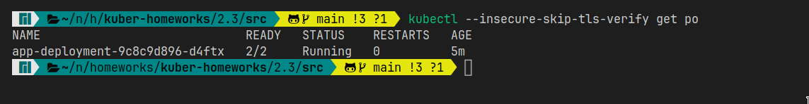
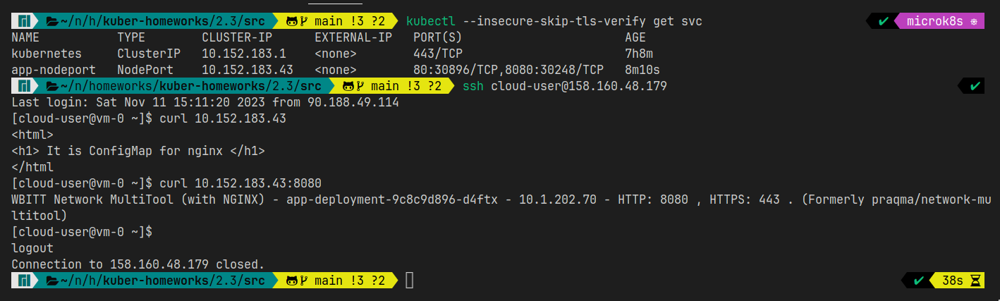
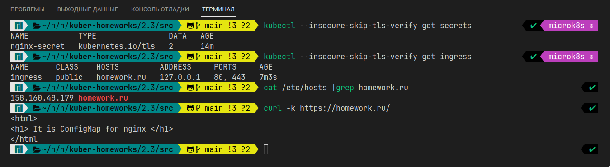

# Домашнее задание к занятию «Конфигурация приложений»

### Цель задания

В тестовой среде Kubernetes необходимо создать конфигурацию и продемонстрировать работу приложения.

------

### Чеклист готовности к домашнему заданию

1. Установленное K8s-решение (например, MicroK8s).
2. Установленный локальный kubectl.
3. Редактор YAML-файлов с подключённым GitHub-репозиторием.

* Развернул MicroK8S на ВМ в Яндекc.Облако с помощью ansible: [install_microk8s.yml](../1.1/playbook/install_microk8s.yml)
------

### Инструменты и дополнительные материалы, которые пригодятся для выполнения задания

1. [Описание](https://kubernetes.io/docs/concepts/configuration/secret/) Secret.
2. [Описание](https://kubernetes.io/docs/concepts/configuration/configmap/) ConfigMap.
3. [Описание](https://github.com/wbitt/Network-MultiTool) Multitool.

------

### Задание 1. Создать Deployment приложения и решить возникшую проблему с помощью ConfigMap. Добавить веб-страницу

1. Создать Deployment приложения, состоящего из контейнеров nginx и multitool.
   * Создал [Deployment](./src/app-deployment.ymlc)
2. Решить возникшую проблему с помощью ConfigMap.
   * Создал [ConfigMap](./src/cmap.yml)
3. Продемонстрировать, что pod стартовал и оба конейнера работают.
   
4. Сделать простую веб-страницу и подключить её к Nginx с помощью ConfigMap. Подключить Service и показать вывод curl или в браузере.
   * Создал [Service](./src/app-service.yml)
   

------

### Задание 2. Создать приложение с вашей веб-страницей, доступной по HTTPS 

1. Создать Deployment приложения, состоящего из Nginx.
   * Создал [Deployment](./src/nginx.yml)
2. Создать собственную веб-страницу и подключить её как ConfigMap к приложению.
   * Создал [ConfigMap](./src/cmap.yml)
3. Выпустить самоподписной сертификат SSL. Создать Secret для использования сертификата.
   * Создал [Secret](./src/nginx-secret.yml)
4. Создать Ingress и необходимый Service, подключить к нему SSL в вид. Продемонстировать доступ к приложению по HTTPS.
   * Создал [Ingress](./src/ingress.yml) и [Service](./src/nginx_svc.yaml)
    