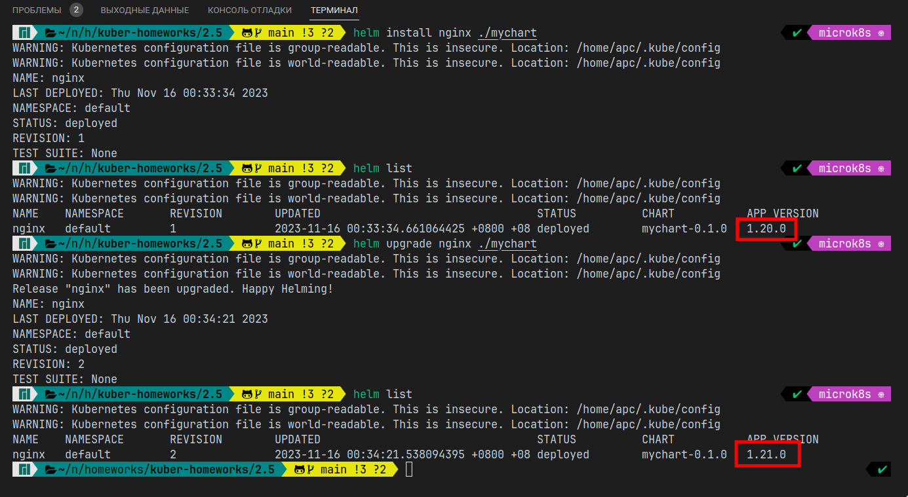
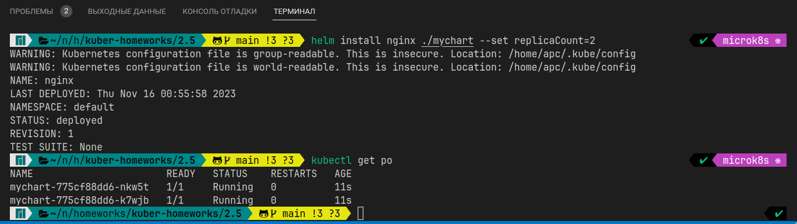
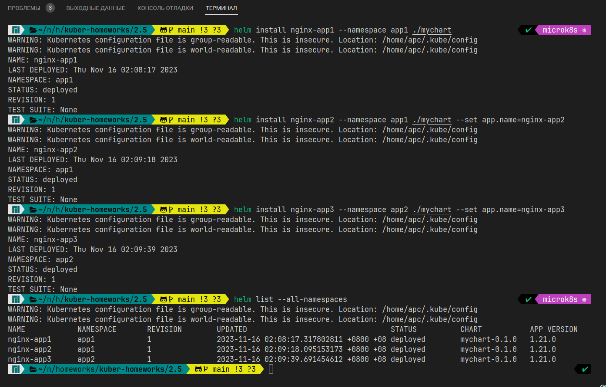

# Домашнее задание к занятию «Helm»

### Цель задания

В тестовой среде Kubernetes необходимо установить и обновить приложения с помощью Helm.

------

### Чеклист готовности к домашнему заданию

1. Установленное k8s-решение, например, MicroK8S.
2. Установленный локальный kubectl.
3. Установленный локальный Helm.
4. Редактор YAML-файлов с подключенным репозиторием GitHub.

* Развернул MicroK8S на ВМ в Яндекc.Облако с помощью ansible: [install_microk8s.yml](../1.1/playbook/install_microk8s.yml)
------

### Инструменты и дополнительные материалы, которые пригодятся для выполнения задания

1. [Инструкция](https://helm.sh/docs/intro/install/) по установке Helm. [Helm completion](https://helm.sh/docs/helm/helm_completion/).

------

### Задание 1. Подготовить Helm-чарт для приложения

1. Необходимо упаковать приложение в чарт для деплоя в разные окружения.
   * Сам [chart](./mychart/)
2. Каждый компонент приложения деплоится отдельным deployment’ом или statefulset’ом.
   * Компоненты [Deployment](./mychart/templates/deployment.yaml), [service](./mychart/templates/service.yaml) и [ingress](./mychart/templates/ingress.yaml)
3. В переменных чарта измените образ приложения для изменения версии.
   

------
### Задание 2. Запустить две версии в разных неймспейсах

1. Подготовив чарт, необходимо его проверить. Запуститe несколько копий приложения.
   
2. Одну версию в namespace=app1, вторую версию в том же неймспейсе, третью версию в namespace=app2.
   

