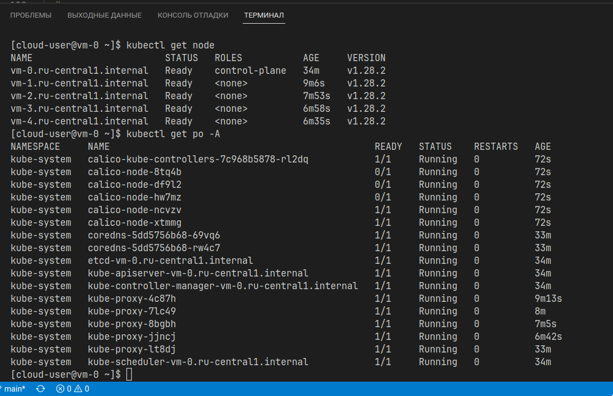

# Домашнее задание к занятию «Установка Kubernetes»

### Цель задания

Установить кластер K8s.

### Чеклист готовности к домашнему заданию

1. Развёрнутые ВМ с ОС Ubuntu 20.04-lts.
   * Установку кластера К8s сделал на ОС AlmaLinux 9
    

### Инструменты и дополнительные материалы, которые пригодятся для выполнения задания

1. [Инструкция по установке kubeadm](https://kubernetes.io/docs/setup/production-environment/tools/kubeadm/create-cluster-kubeadm/).
2. [Документация kubespray](https://kubespray.io/).

-----

### Задание 1. Установить кластер k8s с 1 master node

1. Подготовка работы кластера из 5 нод: 1 мастер и 4 рабочие ноды.
   * Подготовил ноды с помощь [ansible](./playbook/configuration_k8s_nodes.yaml)
2. В качестве CRI — containerd.
3. Запуск etcd производить на мастере.
4. Способ установки выбрать самостоятельно.

* Иницилизацию мастера и подключение воркеров осуществлял в ручную.
  

## Дополнительные задания (со звёздочкой)

**Настоятельно рекомендуем выполнять все задания под звёздочкой.** Их выполнение поможет глубже разобраться в материале.   
Задания под звёздочкой необязательные к выполнению и не повлияют на получение зачёта по этому домашнему заданию. 

------
### Задание 2*. Установить HA кластер

1. Установить кластер в режиме HA.
2. Использовать нечётное количество Master-node.
3. Для cluster ip использовать keepalived или другой способ.

Для разворачивания кластера подготовил [ansible скрипт](./playbook/install_k8s.yaml), каторый конфигурирует и устанавливет ПО. Кластер состоит из 3 мастера, 2 воркера и балансировщик haproxy.Пытался реализовать отказоусточивый балансировщик из 2-х haproxy + keepalived но не получилось увидеть *Виртуальный IP*, возможно это связано с блокировками атак, типа arp spoofing, storm-control и т.д. на стороне яндкекс.облака. Остановиля на одном haproxy.

Иницилизацию мастера и подключение воркеров осуществлял в ручную. В качастве сетевого плагина использовал Calico.

