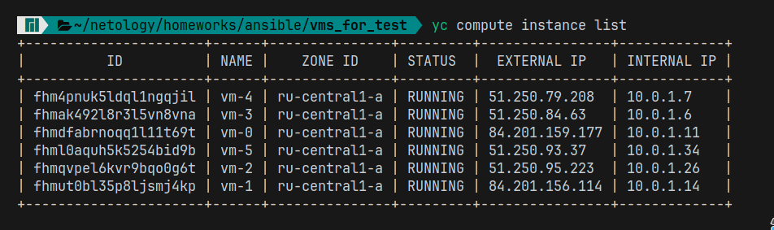
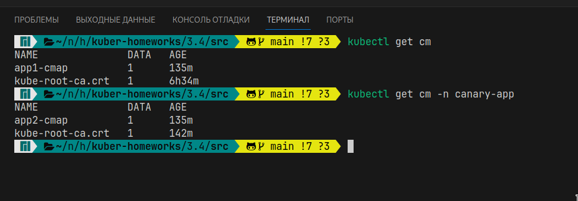

# Домашнее задание к занятию «Обновление приложений»

### Цель задания

Выбрать и настроить стратегию обновления приложения.

### Чеклист готовности к домашнему заданию

1. Кластер K8s.
   * Разворачивал кластер с помощью [ansible](../3.2/playbook/install_k8s.yaml)
    
    

### Инструменты и дополнительные материалы, которые пригодятся для выполнения задания

1. [Документация Updating a Deployment](https://kubernetes.io/docs/concepts/workloads/controllers/deployment/#updating-a-deployment).
2. [Статья про стратегии обновлений](https://habr.com/ru/companies/flant/articles/471620/).

-----

### Задание 1. Выбрать стратегию обновления приложения и описать ваш выбор

1. Имеется приложение, состоящее из нескольких реплик, которое требуется обновить.
2. Ресурсы, выделенные для приложения, ограничены, и нет возможности их увеличить.
3. Запас по ресурсам в менее загруженный момент времени составляет 20%.
4. Обновление мажорное, новые версии приложения не умеют работать со старыми.
5. Вам нужно объяснить свой выбор стратегии обновления приложения.
   
  > Исходя из требовании лудше всего подходит cтратегия 'Recreate' — повторное создание

### Задание 2. Обновить приложение

1. Создать deployment приложения с контейнерами nginx и multitool. Версию nginx взять 1.19. Количество реплик — 5.
   * Создал [deployment](./src/app-deployment.yaml)
    
2. Обновить версию nginx в приложении до версии 1.20, сократив время обновления до минимума. Приложение должно быть доступно.
   
3. Попытаться обновить nginx до версии 1.28, приложение должно оставаться доступным.
   
4. Откатиться после неудачного обновления.
   

## Дополнительные задания — со звёздочкой*

Задания дополнительные, необязательные к выполнению, они не повлияют на получение зачёта по домашнему заданию. **Но мы настоятельно рекомендуем вам выполнять все задания со звёздочкой.** Это поможет лучше разобраться в материале.   

### Задание 3*. Создать Canary deployment

1. Создать два deployment'а приложения nginx.
   * Создал [deployment](./src/app-deployment.yaml) и [Canary deployment](./src/canary-app-dep.yaml)
     
2. При помощи разных ConfigMap сделать две версии приложения — веб-страницы.
   * [ConfigMap](./src/cmap_app1.yaml) для приложения версии 1, [ConfigMap](./src/cmap_app2.yaml) для приложения версии 2
    
3. С помощью ingress создать канареечный деплоймент, чтобы можно было часть трафика перебросить на разные версии приложения.
   * Создал [ingress](./src/ingress_app1.yaml) для приложения версии 1, [ingress](./src/canary_ingress.yaml) для приложения версии 2 
    
   * Так же создал сервисы к приложениям [Service](./src/app-svc.yaml) и [Canary service](./src/canary-app-svc.yaml)
    
   * Для балансировки нагрузки приложения между воркерами использовал haproxy
    

Рапределение трафика осуществляется 30% на приложение 2, остальное на приложение 1. Для тестирования создал [bash скрипт](./src/count_request.sh).

Примерные расчеты соответсвуют стратегии обновлении:
